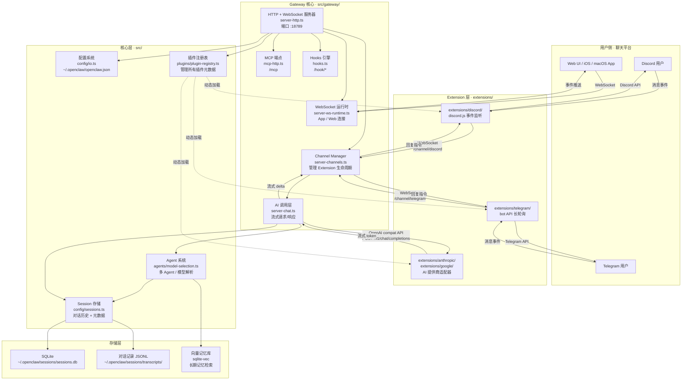
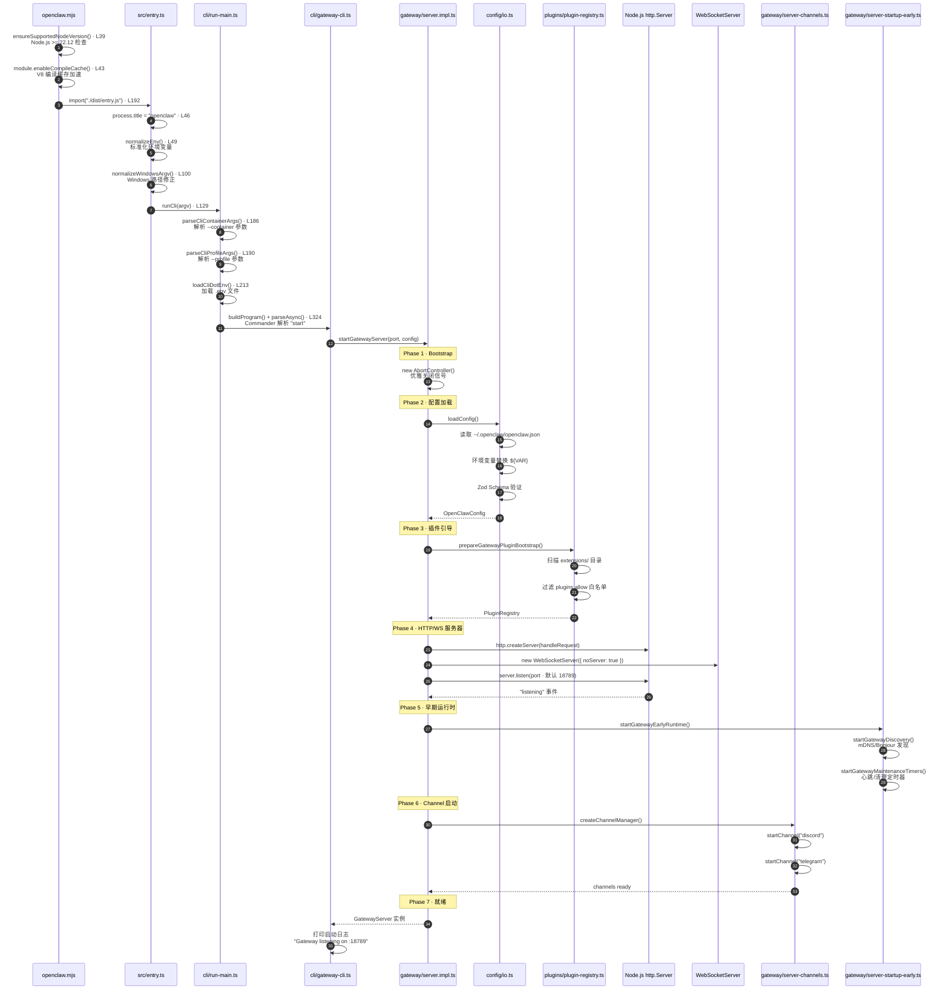
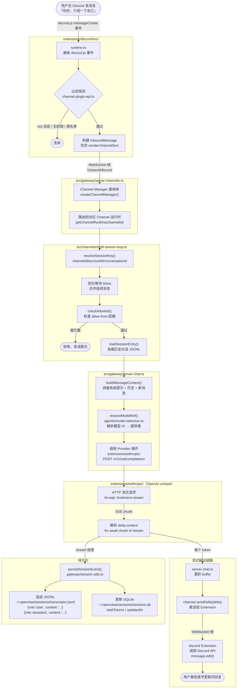
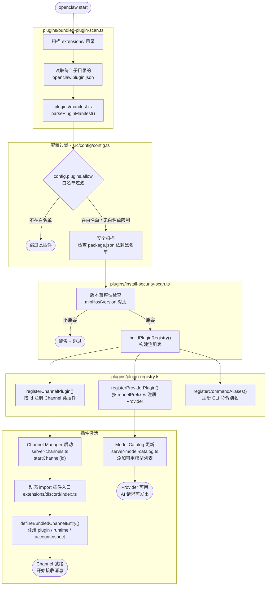
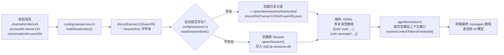

# 系统架构图与完整业务执行流程

> 本文用 Mermaid 图表覆盖 4 类视图：
> 1. 系统整体架构
> 2. Gateway 启动时序
> 3. 消息端到端执行流程（请求 → 响应）
> 4. 插件加载生命周期

---

## 1. 系统整体架构图

---

## 2. Gateway 启动时序图

> 对应代码：`openclaw.mjs` → `src/entry.ts` → `src/cli/run-main.ts` → `src/cli/gateway-cli.ts` → `src/gateway/server.impl.ts`

---

## 3. 完整消息端到端执行流程图

> 从用户发送一条消息，到收到 AI 流式回复，标注每一步对应的源码位置。

---

## 4. 插件加载生命周期图

---

## 5. Session Key 生成与会话路由图

---

## 图例说明

| 符号 | 含义 |
|------|------|
| `实线箭头 →` | 同步调用或数据流向 |
| `虚线箭头 -.->` | 动态加载 / 懒加载关系 |
| `autonumber` | 时序图步骤编号（按调用顺序） |
| `Note over X` | 该阶段的说明注释 |
| `subgraph` | 同一模块/文件内的代码块 |
| `(["..."])` | 终态节点（用户可见的结果） |

---

## 与其他文档的对应关系

| 本文图表 | 对应知识文档 | 对应详细计划 |
|---------|------------|------------|
| 系统架构图 | [01-project-structure.md](./01-project-structure.md) | — |
| Gateway 启动时序 | [04-gateway-server.md](./04-gateway-server.md) | [11-week2-days8-14-详细计划.md](./11-week2-days8-14-详细计划.md) Day 8 |
| 消息端到端流程 | [05-channel-plugin-system.md](./05-channel-plugin-system.md) + [06-session-and-ai.md](./06-session-and-ai.md) | [12-week3-days15-21-详细计划.md](./12-week3-days15-21-详细计划.md) Day 17 |
| 插件加载生命周期 | [05-channel-plugin-system.md](./05-channel-plugin-system.md) | [12-week3-days15-21-详细计划.md](./12-week3-days15-21-详细计划.md) Day 15 |
| Session Key 路由 | [06-session-and-ai.md](./06-session-and-ai.md) | [13-week4-week5-详细计划.md](./13-week4-week5-详细计划.md) Day 22 |
