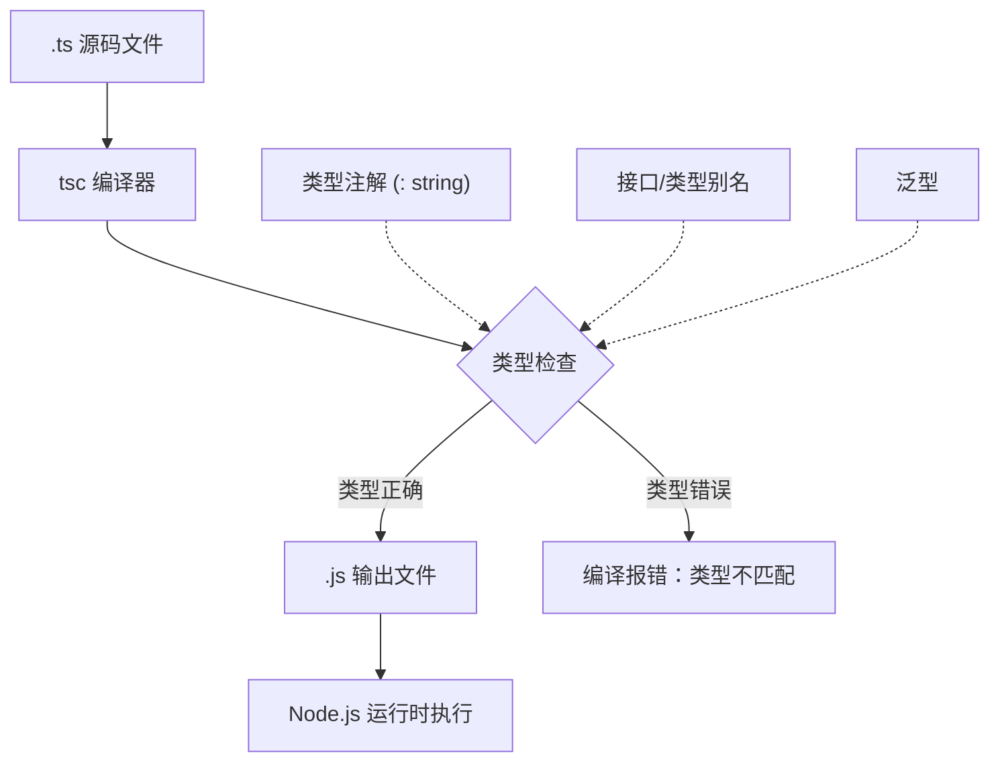
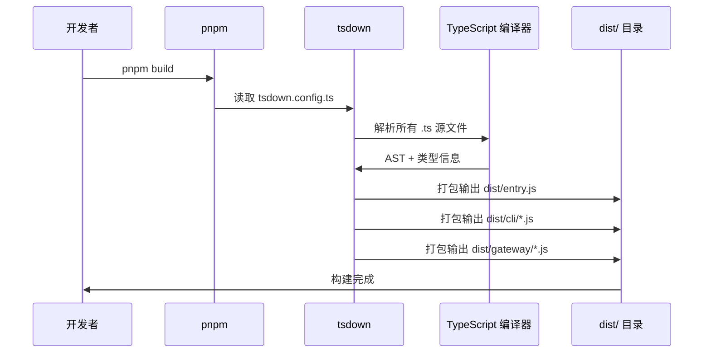
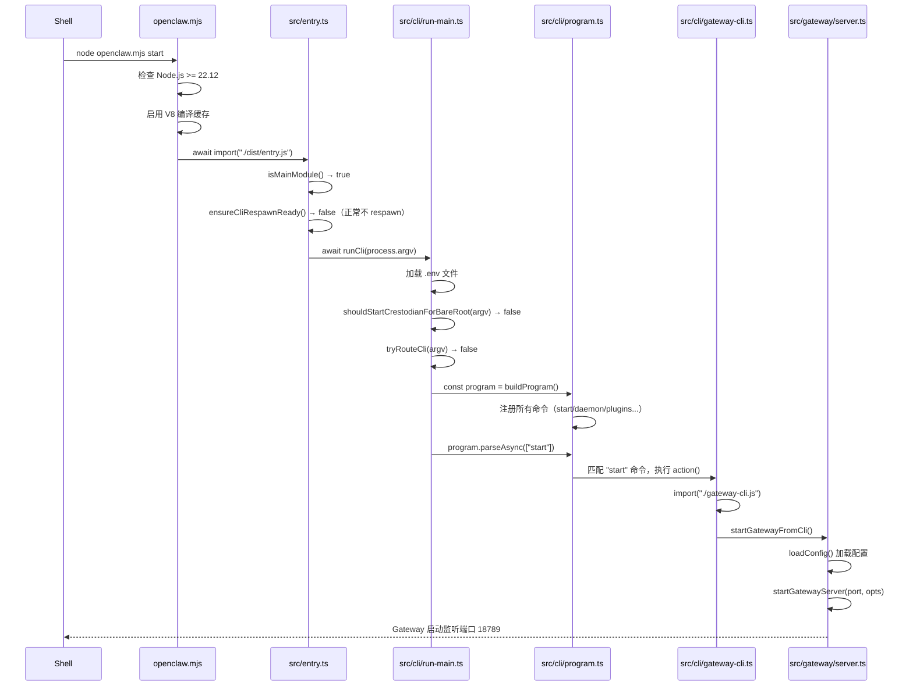
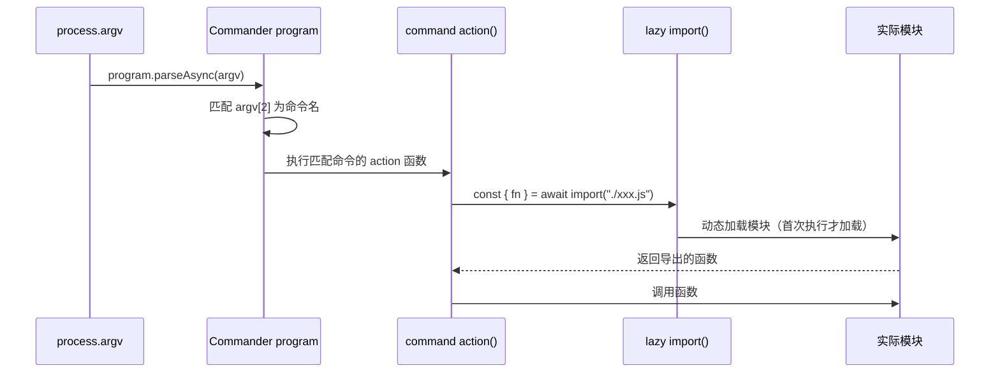
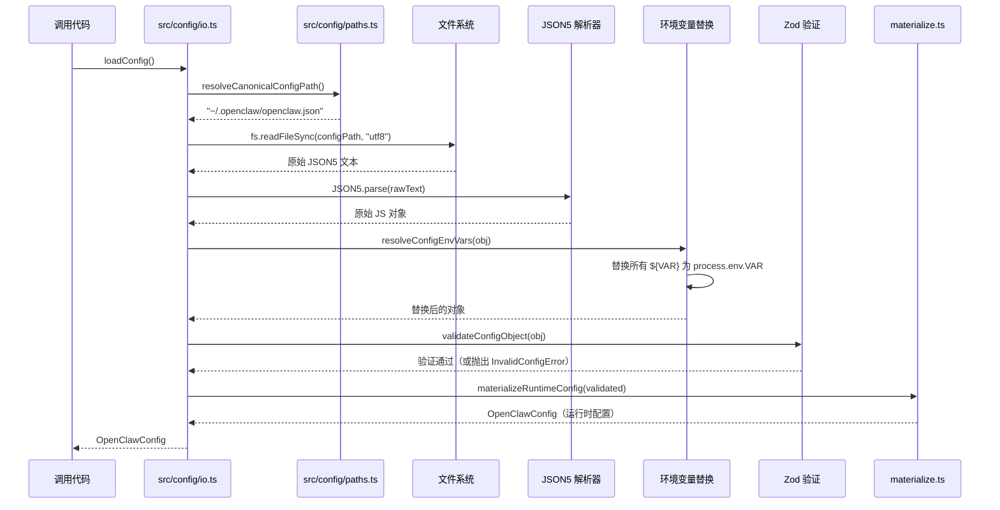

# 第一周详细学习计划（Day 1-7）

> 目标：建立 TypeScript 基础感知、搞懂项目结构、完全理解 `openclaw start` 的入口链和配置系统
>
> 前提：已安装 Node.js >= 22.12，pnpm，已克隆 openclaw 仓库

---

## Day 1 — TypeScript 语言基础 (4h)

### 学习目标

- 消除 TypeScript 陌生感，能读懂 OpenClaw 代码基本语法
- 理解 `type`、`interface`、泛型、`as const`、可选链（`?.`）等关键语法
- 用两个简单的工具文件作为实操对象

---

### 序列图：TypeScript 类型推导过程



---

### 详细任务清单

#### 任务 1：阅读 `00-typescript-primer.md` (1h)

**阅读范围**：`src_code_docs/00-typescript-primer.md` 全文

**理解重点**（阅读时逐一回答）：
1. `type` 和 `interface` 的区别是什么？
2. `string | undefined` 和 `string?` 有什么不同？
3. `as const` 会把数组/对象变成什么？
4. 泛型 `<T>` 在函数定义中怎么用？

---

#### 任务 2：阅读 `src/infra/env.ts` (1h)

**阅读范围**：`src/infra/env.ts` 全文（约 50 行）

**代码解读**：找到这个函数，逐行分析：

```typescript
// 文件：src/infra/env.ts
export function isTruthyEnvValue(value: string | undefined): boolean {
  return value === "1" || value?.toLowerCase() === "true";
}
```

**逐行理解**：
- `value: string | undefined` — 参数类型，允许传入字符串或 `undefined`
- `value === "1"` — 精确等于字符串 "1"，JavaScript `===` 不做类型转换
- `value?.toLowerCase()` — 可选链：如果 `value` 是 `undefined`，整个表达式返回 `undefined` 而不是报错
- `=== "true"` — 所以如果 value 是 undefined，`undefined === "true"` 返回 `false`，总体返回 `false`

**接口调用关系**：

```
isTruthyEnvValue(value: string | undefined) → boolean
  被调用位置（grep 搜索）:
    src/infra/env.ts:isTruthyEnvValue
    → 多处 src/config/*.ts 中判断环境变量开关
```

**Debug 实操**：在终端执行（不需要构建，直接用 Node.js）：

```bash
# 在仓库根目录执行
node -e "
function isTruthyEnvValue(value) {
  return value === '1' || value?.toLowerCase() === 'true';
}
console.log(isTruthyEnvValue('1'));
console.log(isTruthyEnvValue('true'));
console.log(isTruthyEnvValue('TRUE'));
console.log(isTruthyEnvValue('false'));
console.log(isTruthyEnvValue(undefined));
"
```

**预期输出**：
```
true
true
true
false
false
```

---

#### 任务 3：阅读 `src/infra/errors.ts` (1h)

**阅读范围**：`src/infra/errors.ts` 全文（约 60 行）

**理解重点**：
- OpenClaw 如何定义自定义错误类
- `class XxxError extends Error` 模式
- 错误的 `name` 属性为什么要设置

**代码结构模式**：

```typescript
// OpenClaw 自定义错误的统一模式
export class SomeError extends Error {
  readonly name = "SomeError";  // 使 instanceof 和 console.log 清晰
  constructor(message: string, public readonly details?: unknown) {
    super(message);
  }
}
```

**知识点**：
- `readonly name = "SomeError"` — 类属性，只读，每个实例都有这个值
- `public readonly details?` — 构造函数参数自动变成实例属性（TypeScript 语法糖）
- `super(message)` — 调用父类 `Error` 的构造函数，设置 `message` 属性

---

#### 任务 4：阅读 `src/version.ts` + `src/utils.ts` (1h)

**阅读范围**：
- `src/version.ts` 全文
- `src/utils.ts` 前 80 行

**理解重点**：
- `as const` 的用法（可能出现在版本号数组中）
- `export const` vs `export function` 的区别
- 工具函数如何导出和使用

---

### 知识检验

完成 Day 1 后，不看代码，能回答以下问题：

1. `value?.toLowerCase()` 中，如果 `value` 是 `undefined`，结果是什么？（答：`undefined`）
2. TypeScript 的 `interface` 和 `type` 最主要的使用区别？
3. 为什么自定义 Error 类要设置 `name` 属性？

---

### 常见疑问

**Q：为什么 import 路径是 `.js` 而不是 `.ts`？**

A：TypeScript ESM 模块规范要求 import 路径使用运行时的文件名（即编译后的 `.js`）。TypeScript 编译器会把 `.ts` 文件编译成 `.js`，所以 import 时就用 `.js`。这是 OpenClaw 全仓库的约定。

**Q：`export default` 和 `export const` 有什么区别？**

A：`export default` 导出一个默认值，import 时可以用任意名字；`export const` 导出有名字的绑定，import 时必须用花括号 `{ functionName }`。

---

## Day 2 — 项目结构与构建系统 (4h)

### 学习目标

- 理解 pnpm workspace monorepo 的目录组织
- 理解 tsdown（基于 Rolldown）的打包流程
- 能成功构建项目并运行 `openclaw --help`

---

### 序列图：pnpm build 构建流程



---

### 详细任务清单

#### 任务 1：阅读 `01-project-structure.md` (1h)

**阅读范围**：`src_code_docs/01-project-structure.md` 全文

**重点关注**：

```
openclaw/
├── src/           ← 核心代码（Gateway、CLI、配置、AI层等）
├── extensions/    ← 插件（discord、telegram、anthropic 等）
├── packages/      ← 共享库（plugin-sdk 等）
├── apps/          ← 原生应用（iOS、macOS、Android）
├── skills/        ← 技能插件（canvas 等）
├── openclaw.mjs   ← 最外层 CLI 入口（可执行脚本）
├── package.json   ← 根包配置
└── tsdown.config.ts ← 构建配置
```

**接口调用关系图（目录层级）**：

```
openclaw.mjs（可执行文件）
  └── import("./dist/entry.js")
        └── src/entry.ts（TypeScript 源码）
              └── import("./cli/run-main.js")
                    └── src/cli/run-main.ts
                          └── import("./program.js")
                                └── src/cli/program.ts（Commander 命令树）
```

---

#### 任务 2：阅读 `package.json` 的 scripts 字段 (30m)

**阅读范围**：根目录 `package.json`，重点看 `scripts` 字段

**关键 scripts 及其作用**：

| 命令 | 作用 |
|------|------|
| `pnpm build` | 运行 tsdown，编译所有 TypeScript 到 dist/ |
| `pnpm test` | 运行 vitest 单元测试 |
| `pnpm typecheck` | 只做类型检查，不输出文件 |
| `pnpm lint` | ESLint 代码质量检查 |

---

#### 任务 3：阅读 `tsdown.config.ts` (30m)

**阅读范围**：根目录 `tsdown.config.ts` 全文（约 330 行）

**注意**：这个文件远比想象中复杂，没有简单的 `entry`/`format`/`outDir` 字段，入口列表是动态构建的。阅读时抓住以下脉络：

**第一步：从底部的 `export default` 开始读（L318-329）**

```typescript
// tsdown.config.ts L318-329（文件末尾的导出，是真正的入口点）
export default defineConfig([
  nodeBuildConfig({
    clean: true,
    entry: buildUnifiedDistEntries(),   // ← 核心：统一构建所有入口
    deps: {
      neverBundle: shouldNeverBundleDependency,  // ← 哪些包不打包进去
    },
  }),
  ...buildBundledPluginConfigs(),  // ← 部分插件单独构建（需要 stage 运行时依赖）
]);
```

**第二步：理解 `nodeBuildConfig()`（L84-92）**

```typescript
// tsdown.config.ts L84-92
function nodeBuildConfig(config: UserConfig): UserConfig {
  return {
    ...config,
    env: { NODE_ENV: "production" },  // 注入生产环境变量
    fixedExtension: false,             // 输出 .js（不是 .mjs/.cjs）
    platform: "node",                  // 目标平台是 Node.js
    inputOptions: buildInputOptions,   // 自定义日志过滤（忽略 EVAL 警告等）
  };
}
```

**第三步：理解 `buildCoreDistEntries()`（L204-235）— 最重要**

```typescript
// tsdown.config.ts L204-235（节选，实际有 20+ 条）
function buildCoreDistEntries(): Record<string, string> {
  return {
    index:  "src/index.ts",     // → dist/index.js  （库模式入口）
    entry:  "src/entry.ts",     // → dist/entry.js  （CLI 主入口 ← 最重要）
    "cli/daemon-cli": "src/cli/daemon-cli.ts",  // 显式独立入口
    "infra/warning-filter": "src/infra/warning-filter.ts",
    extensionAPI: "src/extensionAPI.ts",
    // ... 共约 20 个显式入口
  };
}
```

**第四步：理解为什么这么复杂**

| 原因 | 说明 |
|------|------|
| plugin-sdk 有 300+ 子路径导出 | 每个子路径单独打包，按需引入不打包全量 |
| 插件和钩子单独入口 | `extensions/xxx/` 下每个插件有独立 dist 产物 |
| 运行时边界文件 | `*.runtime.ts` 文件保持稳定文件名，确保 Gateway 热重载可用 |
| 跨平台兼容 | `fixedExtension: false` 确保输出 `.js`（不是 `.mjs`） |

**Debug 验证**：构建后查看 dist/ 的入口结构

```bash
# 构建后
pnpm build

# 查看生成的核心入口
ls dist/entry.js dist/index.js dist/cli/daemon-cli.js
# 预期：三个文件都存在

# 查看 plugin-sdk 子路径
ls dist/plugin-sdk/ | head -10
# 预期：channel-core.js, runtime.js, setup.js 等 300+ 文件
```

---

#### 任务 4：实操构建 (1h)

**步骤**：

```bash
# 步骤 1：安装依赖（约 2-5 分钟）
pnpm install

# 步骤 2：构建（约 30-60 秒）
pnpm build

# 步骤 3：验证构建成功
ls dist/
# 预期：看到 entry.js 和其他文件

# 步骤 4：运行 CLI 帮助
node openclaw.mjs --help
```

**预期输出**（节选）：
```
Usage: openclaw [options] [command]

Options:
  -V, --version   output the version number
  -h, --help      display help for command

Commands:
  start           Start the OpenClaw gateway
  daemon          Manage the OpenClaw daemon
  plugins         Manage plugins
  ...
```

---

#### 任务 5：阅读目录结构，建立心智模型 (1h)

执行以下命令，观察关键目录的文件数量：

```bash
# 查看 extensions 下有哪些插件
ls extensions/

# 查看 src/ 下的主要子目录
ls src/

# 查看 packages/ 下有什么
ls packages/
```

**Debug 实操**：在 `openclaw.mjs` 第 1 行之后添加一行日志，验证入口被执行：

```javascript
// 在 openclaw.mjs 最顶部（shebang 行之后）添加：
console.error(">>> openclaw.mjs 被执行，Node.js 版本:", process.version);
```

然后运行：
```bash
node openclaw.mjs --help 2>&1 | head -5
```

**预期输出**：
```
>>> openclaw.mjs 被执行，Node.js 版本: v22.x.x
Usage: openclaw [options] [command]
...
```

> 记得测试完后删除这行 console.error

---

### 知识检验

1. `pnpm build` 后，TypeScript 文件被编译到哪个目录？
2. `openclaw.mjs` 是如何加载实际逻辑的？（答：`await import("./dist/entry.js")`）
3. `extensions/` 和 `packages/` 有什么区别？

---

## Day 3 — 入口链深入 (4h)

### 学习目标

- 完全搞懂 `openclaw start` 从执行到 Gateway 启动的**完整调用链**
- 理解 `isMainModule()` 判断机制
- 理解懒加载（dynamic import）在 CLI 启动优化中的作用

---

### 序列图：`openclaw start` 完整调用链



---

### 详细任务清单

#### 任务 1：阅读 `02-entry-and-cli.md` (30m)

**阅读范围**：`src_code_docs/02-entry-and-cli.md` 全文

---

#### 任务 2：精读 `openclaw.mjs` (1h)

**阅读范围**：根目录 `openclaw.mjs` 全文

**关键代码解读**：

```javascript
// openclaw.mjs 关键逻辑（简化版）

// 1. 检查 Node.js 版本
const MIN_NODE_MAJOR = 22;
const [major] = process.versions.node.split(".").map(Number);
if (major < MIN_NODE_MAJOR) {
  console.error(`需要 Node.js >= ${MIN_NODE_MAJOR}`);
  process.exit(1);
}

// 2. 快速帮助路径（不加载完整程序）
if (isBareRootHelpInvocation(process.argv)) {
  // 直接打印预计算的帮助文本，毫秒级响应
  process.stdout.write(precomputedHelp);
  process.exit(0);
}

// 3. 真正的入口
await import("./dist/entry.js");
```

**接口关系**：
- `isBareRootHelpInvocation(argv: string[]): boolean` — 判断是否是 `openclaw --help`
- `await import("./dist/entry.js")` — 加载编译后的 TypeScript 入口

**Debug 实操**：在 `openclaw.mjs` 加载 `dist/entry.js` 之前添加计时日志：

```javascript
// 在 await import("./dist/entry.js"); 之前添加：
const t0 = Date.now();
console.error(`[TIMING] openclaw.mjs → 开始加载 dist/entry.js, t=${t0}`);
await import("./dist/entry.js");
// 注意：这行不会执行（entry.js 内部会 process.exit）
```

运行：
```bash
node openclaw.mjs --version 2>&1
```

---

#### 任务 3：精读 `src/entry.ts` (1h)

**阅读范围**：`src/entry.ts` 全文（189 行）

**关键函数定位**：

```
src/entry.ts:
  L1-17    imports
  L18-21   ENTRY_WRAPPER_PAIRS 常量（定义 .mjs 和 .js 的对应关系）
  L38-42   isMainModule({ currentFile, wrapperEntryPairs }) → boolean
  L129     runMainOrRootHelp(argv: string[]) — 决策入口
  L134-172 tryHandleRootHelpFastPath() — 快速帮助路径
  L174-189 主逻辑：if (isMainModule) → runCli(argv)
```

**核心判断 `isMainModule()`**：

```typescript
// src/entry.ts L38-42（简化）
function isMainModule({ currentFile }: IsMainModuleParams): boolean {
  // 判断当前文件是否是 Node.js 的主模块（直接运行，非 import）
  // 类比 Python 的 if __name__ == "__main__"
  return currentFile === process.argv[1] ||
         currentFile === fileURLToPath(import.meta.url);
}
```

**Debug 实操**：在 `src/entry.ts` 的 `runCli` 调用之前添加日志（需要 pnpm build 后才生效）：

```typescript
// src/entry.ts，在 await runCli(process.argv); 之前添加：
console.error("[entry.ts] isMain=true, 即将调用 runCli, argv:", process.argv.slice(2));
```

步骤：
```bash
# 1. 修改 src/entry.ts（添加上面的 console.error）
# 2. 重新构建
pnpm build

# 3. 运行并观察
node openclaw.mjs start 2>&1 | head -3
```

**预期输出**：
```
[entry.ts] isMain=true, 即将调用 runCli, argv: ["start"]
```

---

#### 任务 4：精读 `src/cli/run-main.ts` 的 `runCli()` 函数 (1.5h)

**阅读范围**：`src/cli/run-main.ts` 第 83-310 行（`runCli` 函数）

**函数签名**：

```typescript
// src/cli/run-main.ts L83
export async function runCli(argv: string[] = process.argv): Promise<void>
```

**内部执行阶段**（逐步理解）：

| 代码位置 | 阶段 | 作用 |
|---------|------|------|
| L84-95 | 参数预处理 | 处理 `--container` 参数 |
| L111-114 | 加载 .env | 读取 `.env` 文件到 `process.env` |
| L130-137 | 快速帮助路径 | `openclaw --help` 时直接返回 |
| L146-175 | Crestodian 快速路径 | `openclaw`（无参数）时启动 TUI |
| L189-191 | tryRouteCli | 尝试别名路由 |
| L193-306 | 完整 CLI 启动 | 构建 Commander 程序，解析命令 |

**接口调用关系**：

```
runCli(argv: string[]) [run-main.ts:83]
  ├── shouldStartCrestodianForBareRoot(argv) [run-main.ts:146]
  │     └── returns: boolean
  ├── tryRouteCli(argv) [src/cli/route.ts]
  │     └── returns: Promise<boolean>
  ├── buildProgram() [src/cli/program.ts]
  │     └── returns: Command (Commander.js)
  └── program.parseAsync(argv) [Commander.js]
        └── 触发匹配命令的 action()
```

**Debug 实操**：

```typescript
// src/cli/run-main.ts:83 后面加（在函数体第一行）：
console.error("[run-main.ts] runCli 被调用，args:", argv.slice(2));
```

重新构建后：
```bash
pnpm build && node openclaw.mjs plugins list 2>&1 | head -5
```

**预期输出**：
```
[run-main.ts] runCli 被调用，args: ["plugins", "list"]
```

---

#### 任务 5：阅读 `src/cli/route.ts` (30m)

**阅读范围**：`src/cli/route.ts` 全文

**理解重点**：
- `tryRouteCli` 是如何做命令别名/快速路由的
- 返回 `true` 表示已处理，`false` 表示交给 Commander 处理

---

### 知识检验

不看代码，能画出 `openclaw start` 的调用链（5个关键节点）：

```
openclaw.mjs → ? → ? → ? → Gateway 启动
```

答案：
```
openclaw.mjs → src/entry.ts → src/cli/run-main.ts → src/cli/program.ts → src/cli/gateway-cli.ts → src/gateway/server.ts
```

---

## Day 4 — CLI 命令树深入 (5h)

### 学习目标

- 理解所有 CLI 命令的注册机制（静态 vs 动态）
- 理解 Commander.js 的核心 API
- 能给 CLI 添加一个新命令

---

### 序列图：Commander 命令解析流程



---

### 详细任务清单

#### 任务 1：浏览 `src/cli/program.ts` (1h)

**阅读范围**：`src/cli/program.ts` 全文

**关键模式**：Commander.js 命令注册：

```typescript
// src/cli/program.ts（典型命令注册模式）
program
  .command("start")                          // 命令名
  .alias("gateway")                          // 别名
  .description("Start the OpenClaw gateway") // 帮助文本
  .option("--port <port>", "Port to listen") // 选项（带参数）
  .option("--verbose", "Verbose output")     // 开关选项
  .action(async (options) => {               // 执行回调（async）
    // 懒加载：只有执行 start 命令时才加载这些模块
    const { startGatewayFromCli } = await import("./gateway-cli.js");
    await startGatewayFromCli(options);
  });
```

**Commander.js 核心 API**：

| API | 说明 |
|-----|------|
| `.command(name)` | 定义子命令 |
| `.description(text)` | 设置帮助描述 |
| `.option(flags, desc)` | 定义选项 |
| `.argument(<name>)` | 定义位置参数 |
| `.action(fn)` | 绑定执行函数 |
| `.addCommand(sub)` | 添加嵌套子命令 |

**列出所有顶层命令**：

```bash
node openclaw.mjs --help
```

---

#### 任务 2：精读 `src/cli/gateway-cli.ts` (1h)

**阅读范围**：`src/cli/gateway-cli.ts` 全文

**关键函数**：

```typescript
// src/cli/gateway-cli.ts
export async function startGatewayFromCli(options?: {
  port?: number;
  verbose?: boolean;
}): Promise<void> {
  // 1. 加载配置
  const config = await loadConfig();

  // 2. 解析端口（命令行选项 > 配置文件 > 默认值 18789）
  const port = options?.port ?? resolveGatewayPort(config);

  // 3. 启动 Gateway
  const { startGatewayServer } = await import("../gateway/server.js");
  await startGatewayServer(port, { config });
}
```

**接口调用关系**：

```
startGatewayFromCli(options?)
  ├── loadConfig() [src/config/io.ts]
  │     └── returns: OpenClawConfig
  ├── resolveGatewayPort(config, env?) [src/config/paths.ts:L285]
  │     └── returns: number (默认 18789)
  └── startGatewayServer(port, opts) [src/gateway/server.ts]
        └── returns: Promise<GatewayServer>
```

---

#### 任务 3：浏览 `src/cli/daemon-cli.ts` 与守护进程架构 (1h)

**阅读范围**：`src/cli/daemon-cli.ts`（16 行薄壳）+ `src/cli/daemon-cli/lifecycle.ts`（前 60 行）+ `src/daemon/service.ts`（L171-215）

**第一步：`daemon-cli.ts` 是纯 re-export**

```typescript
// src/cli/daemon-cli.ts 全文（实际只有 16 行）
export { registerDaemonCli } from "./daemon-cli/register.js";
export { addGatewayServiceCommands } from "./daemon-cli/register-service-commands.js";
export {
  runDaemonInstall,
  runDaemonRestart,
  runDaemonStart,
  runDaemonStatus,
  runDaemonStop,
  runDaemonUninstall,
} from "./daemon-cli/runners.js";
```

真正的逻辑分散在 `src/cli/daemon-cli/` 目录下（约 30 个文件）。

**第二步：理解跨平台服务管理（`src/daemon/service.ts` L171-215）**

OpenClaw 用系统原生服务管理器在后台运行 Gateway：

```typescript
// src/daemon/service.ts L171-215
type SupportedGatewayServicePlatform = "darwin" | "linux" | "win32";

const GATEWAY_SERVICE_REGISTRY = {
  darwin: {
    label: "LaunchAgent",          // macOS：用 launchd（~/Library/LaunchAgents/）
    install: installLaunchAgent,   // 写 .plist 文件
    restart: restartLaunchAgent,   // launchctl kickstart
    isLoaded: isLaunchAgentLoaded, // launchctl list
  },
  linux: {
    label: "systemd",              // Linux：用 systemd（--user）
    install: installSystemdService,// 写 .service 文件
    restart: restartSystemdService,// systemctl --user restart
    isLoaded: isSystemdServiceEnabled,
  },
  win32: {
    label: "Scheduled Task",       // Windows：用任务计划程序
    install: installScheduledTask, // schtasks /create
    restart: restartScheduledTask, // schtasks /end + /run
    isLoaded: isScheduledTaskInstalled,
  },
};

export function resolveGatewayService(): GatewayService {
  // 自动选择当前平台对应的实现
  return GATEWAY_SERVICE_REGISTRY[process.platform as SupportedGatewayServicePlatform];
}
```

**对 Java 程序员**：类似 Spring Boot 的 `ApplicationRunner`，`resolveGatewayService()` 相当于工厂方法，根据平台返回不同实现。  
**对 Python 程序员**：类似 `if sys.platform == "darwin": ...`，但用 Registry 字典封装了多态。

**第三步：`openclaw daemon start` 的执行路径**

```
openclaw daemon start
    ↓
src/cli/daemon-cli/lifecycle.ts: runDaemonStart()   (L152)
    ↓
src/daemon/service.ts: resolveGatewayService()
    ↓
macOS:   installLaunchAgent()  → launchctl load ~/Library/LaunchAgents/ai.openclaw.gateway.plist
Linux:   installSystemdService() → systemctl --user enable openclaw-gateway.service
Windows: installScheduledTask()  → schtasks /create /tn "OpenClaw Gateway"
```

**Debug 实操**：

```bash
# 查看当前平台会用哪种服务管理器
node -e "console.log(process.platform)"
# darwin → LaunchAgent
# linux  → systemd
# win32  → Scheduled Task

# 查看 daemon 相关命令帮助
node openclaw.mjs daemon --help
```

---

#### 任务 4：浏览 `src/cli/plugins-cli.ts` (1h)

**阅读范围**：`src/cli/plugins-cli.ts` L1-60（类型定义）+ L132-200（`registerPluginsCli` 函数体）

**第一步：文件结构总览**

```
src/cli/plugins-cli.ts（约 600 行）
  L17-54    类型定义（PluginsListOptions、PluginUninstallOptions 等）
  L57-130   内部工具函数（格式化输出用）
  L132      registerPluginsCli(program: Command) ← 主入口，注册所有 plugins 子命令
    ├── plugins list
    ├── plugins inspect <id>
    ├── plugins install <source>
    ├── plugins uninstall <id>
    ├── plugins update [id]
    └── plugins marketplace list
```

**第二步：找 `registerPluginsCli` 函数（L132）**

```typescript
// src/cli/plugins-cli.ts L132
export function registerPluginsCli(program: Command) {
  const plugins = program
    .command("plugins")
    .description("Manage OpenClaw plugins and extensions");

  // "plugins list" 子命令
  plugins
    .command("list")
    .option("--json", "Print JSON")
    .option("--enabled", "Only show enabled plugins")
    .action(async (opts: PluginsListOptions) => {
      const { buildPluginRegistrySnapshotReport } = await import("../plugins/status.js");
      // 注意：懒加载，只有执行 list 时才加载 status.js
      const cfg = loadConfig();
      const report = buildPluginRegistrySnapshotReport({ config: cfg, ... });
      // ...格式化并打印表格
    });
  // ...其他子命令
}
```

**第三步：理解插件安装（install）的实际执行路径**

```typescript
// plugins install 命令的 action（找 "install" 关键字）
plugins
  .command("install <source>")    // source = npm包名 / 本地路径 / GitHub URL
  .action(async (source, opts) => {
    const { installPlugin } = await import("../plugins/install.js");  // 懒加载
    await installPlugin(source, {
      config,
      stateDir: resolveStateDir(),
    });
    // 安装后：更新 ~/.openclaw/openclaw.json 的 plugins.allow 列表
  });
```

**安装流程完整链路**：

```
openclaw plugins install discord
    ↓
src/cli/plugins-cli.ts: action("install")
    ↓
src/plugins/install.ts: installPlugin(source)
    ├── 判断 source 类型（npm/本地/GitHub）
    ├── npm install 或 copy 到插件目录
    ├── 读取 openclaw.plugin.json 验证合法性
    └── 更新 config.plugins.allow: [..., "discord"]
```

**Debug 实操**：

```bash
# 查看当前已安装的插件
node openclaw.mjs plugins list

# 查看某个插件的详细信息
node openclaw.mjs plugins inspect discord --json 2>&1 | python3 -m json.tool

# grep 找 install 命令的 action 在文件哪行
grep -n '"install"\|installPlugin' src/cli/plugins-cli.ts | head -10
```

---

#### 任务 5：动手添加一个新命令 (1h)

**练习**：在 `src/cli/program.ts` 中添加 `config echo` 命令，打印当前 Gateway 端口

```typescript
// 在 src/cli/program.ts 中找到合适位置添加：
const configCmd = program
  .command("config")
  .description("Configuration utilities");

configCmd
  .command("echo")
  .description("Print current gateway port")
  .action(async () => {
    const { loadConfig } = await import("../config/io.js");
    const { resolveGatewayPort } = await import("../config/paths.js");
    const config = await loadConfig();
    const port = resolveGatewayPort(config);
    console.log(`Gateway port: ${port}`);
  });
```

**测试**：
```bash
pnpm build && node openclaw.mjs config echo
```

**预期输出**：
```
Gateway port: 18789
```

---

### 知识检验

1. Commander.js 的 `.action()` 回调何时执行？（答：parseAsync 匹配到对应命令时）
2. 为什么命令的实现代码在 `await import()` 里？（答：懒加载，加速 `--help` 响应）
3. `openclaw plugins` 和 `openclaw config` 的 action 函数分别在哪个文件？

---

## Day 5 — 配置系统深入 (6h)

### 学习目标

- 完全理解配置如何从文件加载到内存
- 理解 Zod 验证机制
- 理解环境变量替换 `${VAR}` 的实现

---

### 序列图：配置加载完整流程



---

### 详细任务清单

#### 任务 1：阅读 `03-config-system.md` (1h)

**阅读范围**：`src_code_docs/03-config-system.md` 全文

---

#### 任务 2：精读 `src/config/paths.ts` (1h)

**阅读范围**：`src/config/paths.ts` 全文（约 302 行）

**关键函数**：

```typescript
// src/config/paths.ts L60-89
function resolveStateDir(
  env: NodeJS.ProcessEnv = process.env,
  homedir: string = os.homedir()
): string {
  // 优先级：OPENCLAW_STATE_DIR 环境变量 > ~/.openclaw
  if (env.OPENCLAW_STATE_DIR) {
    return env.OPENCLAW_STATE_DIR;
  }
  return path.join(homedir, ".openclaw");
}
```

```typescript
// src/config/paths.ts L106-115
function resolveCanonicalConfigPath(
  env?: NodeJS.ProcessEnv,
  stateDir?: string
): string {
  // 1. 如果指定了 OPENCLAW_CONFIG_PATH，直接用
  if (env?.OPENCLAW_CONFIG_PATH) return env.OPENCLAW_CONFIG_PATH;

  // 2. 否则：stateDir/openclaw.json
  const dir = stateDir ?? resolveStateDir(env);
  return path.join(dir, "openclaw.json");
}
```

```typescript
// src/config/paths.ts L285-301
function resolveGatewayPort(
  cfg?: { gateway?: { port?: number } },
  env: NodeJS.ProcessEnv = process.env
): number {
  // 优先级：OPENCLAW_GATEWAY_PORT > config.gateway.port > 18789
  if (env.OPENCLAW_GATEWAY_PORT) {
    return parseInt(env.OPENCLAW_GATEWAY_PORT, 10);
  }
  return cfg?.gateway?.port ?? DEFAULT_GATEWAY_PORT; // DEFAULT_GATEWAY_PORT = 18789
}
```

**接口调用关系图**：

```
resolveStateDir(env?, homedir?) → string
  调用方: resolveCanonicalConfigPath, loadConfig, 等
  
resolveCanonicalConfigPath(env?, stateDir?) → string
  调用方: loadConfig [io.ts:1458]
  
resolveGatewayPort(cfg?, env?) → number
  调用方: startGatewayFromCli [gateway-cli.ts]
          resolveGatewayPort [server.impl.ts]
```

**Debug 实操**：

```bash
# 测试路径解析
node --input-type=module << 'EOF'
import { createRequire } from 'module';
import os from 'os';
import path from 'path';

// 模拟 resolveStateDir 逻辑
function resolveStateDir(env = process.env) {
  if (env.OPENCLAW_STATE_DIR) return env.OPENCLAW_STATE_DIR;
  return path.join(os.homedir(), ".openclaw");
}

console.log("默认 stateDir:", resolveStateDir());
console.log("覆盖 stateDir:", resolveStateDir({ OPENCLAW_STATE_DIR: "/tmp/test" }));
EOF
```

**预期输出**：
```
默认 stateDir: C:\Users\username\.openclaw   (Windows)
覆盖 stateDir: /tmp/test
```

---

#### 任务 3：精读 `src/config/io.ts` 的 `loadConfig` 函数 (1h)

**阅读范围**：`src/config/io.ts` 第 1458-1595 行

**注意**：`loadConfig()` 虽然函数名看起来是异步，但内部主要是**同步**的文件读取（`fs.readFileSync`），这是一个重要细节。

**代码结构**：

```typescript
// src/config/io.ts L1458（简化伪代码，帮助理解结构）
function loadConfig(): OpenClawConfig {
  // 1. 确定配置文件路径
  const configPath = resolveCanonicalConfigPath();
  
  // 2. 读取文件（同步）
  const rawText = fs.readFileSync(configPath, "utf8");
  
  // 3. JSON5 解析
  const rawObj = JSON5.parse(rawText);
  
  // 4. @include 指令处理
  const withIncludes = resolveConfigIncludes(rawObj, configPath);
  
  // 5. ${VAR} 环境变量替换
  const withEnvVars = resolveConfigEnvVars(withIncludes);
  
  // 6. Zod 验证
  const validated = validateConfigObject(withEnvVars);  // 失败则抛出
  
  // 7. 转为运行时配置
  const config = materializeRuntimeConfig(validated);
  
  // 8. 缓存到内存
  setRuntimeConfigSnapshot(config);
  
  return config;
}
```

---

#### 任务 4：精读 `src/config/env-substitution.ts` (1h)

**阅读范围**：`src/config/env-substitution.ts` 全文

**关键实现**：

```typescript
// 环境变量替换的核心逻辑（简化）
const ENV_VAR_PATTERN = /\$\{([^}]+)\}/g;  // 匹配 ${VAR_NAME}

function substituteEnvVars(value: string, env: NodeJS.ProcessEnv): string {
  return value.replace(ENV_VAR_PATTERN, (_, varName) => {
    const envValue = env[varName];
    if (envValue === undefined) {
      throw new MissingEnvVarError(`环境变量 ${varName} 未设置`);
    }
    return envValue;
  });
}
```

**Debug 实操**：验证环境变量替换：

```bash
# 临时设置环境变量后运行
ANTHROPIC_API_KEY="test-key-123" node openclaw.mjs config echo 2>&1
```

---

#### 任务 5：浏览 `src/config/types.openclaw.ts` (1h)

**阅读范围**：`src/config/types.openclaw.ts` 前 100 行

**重点理解**：`OpenClawConfig` 的顶层结构：

```typescript
// src/config/types.openclaw.ts（示意）
export type OpenClawConfig = {
  gateway: GatewayConfig;           // Gateway 服务器配置
  providers: ProvidersConfig;       // AI 提供商配置
  agents: AgentsConfig;             // AI Agent 配置
  plugins: PluginsConfig;           // 插件配置
  channels?: Record<string, ...>;  // Channel 配置（可选）
  hooks?: HookConfig[];             // HTTP Hooks
  cron?: CronConfig;                // 定时任务
  mcp?: McpConfig;                  // MCP 配置
  tts?: TtsConfig;                  // TTS 配置
};
```

---

#### 任务 6：阅读 `src/config/validation.ts` + 理解 Zod (1h)

**阅读范围**：`src/config/validation.ts` 全文

**Zod 基础**（对不熟悉 Zod 的开发者）：

```typescript
import { z } from "zod";

// 定义 Schema
const UserSchema = z.object({
  name: z.string(),
  age: z.number().min(0).max(150),
  email: z.string().email().optional(),
});

// 验证
const result = UserSchema.safeParse({ name: "Alice", age: 30 });
if (result.success) {
  console.log(result.data);  // 类型安全的 { name: string, age: number }
} else {
  console.log(result.error.issues);  // 验证错误列表
}
```

**在 OpenClaw 中的使用**：

```typescript
// src/config/validation.ts（简化）
function validateConfigObject(obj: unknown): SourceConfig {
  const result = OpenClawSourceConfigSchema.safeParse(obj);
  if (!result.success) {
    throw new InvalidConfigError(
      formatZodError(result.error)
    );
  }
  return result.data;
}
```

---

### 知识检验

1. 配置文件默认路径是什么？（答：`~/.openclaw/openclaw.json`）
2. 如何用环境变量覆盖 Gateway 端口？（答：`OPENCLAW_GATEWAY_PORT=19000 openclaw start`）
3. `loadConfig()` 是同步还是异步的？（答：主要是同步）
4. `${ANTHROPIC_API_KEY}` 在配置文件中何时被替换？（答：`loadConfig()` 内部的 `resolveConfigEnvVars` 步骤）

---

## Day 6 — 巩固与实践（4h）

### 学习目标

- 复习 Day 1-5 所有知识点
- 整理对项目整体架构的理解
- 完成一个小的代码实践任务

---

### 复习框架

用下面的填空题检验自己的理解：

```
用户执行 openclaw start 时：

1. ________（文件名）检查 Node.js 版本
2. 加载 __________________（文件路径）
3. isMainModule() 返回 ______，进入 CLI 模式
4. 调用 ________________（函数名），在 ______（文件）中定义
5. buildProgram() 返回 ______（Commander 对象）
6. 匹配 "start" 命令，懒加载 ________________
7. loadConfig() 从 ________________ 读取配置
8. startGatewayServer(______) 启动服务器
```

**答案**：
1. `openclaw.mjs`
2. `dist/entry.js`（即 `src/entry.ts`）
3. `true`
4. `runCli()`，在 `src/cli/run-main.ts`
5. `Command`
6. `src/cli/gateway-cli.ts`
7. `~/.openclaw/openclaw.json`
8. `18789`（默认端口）

---

### 代码实践：添加 `config echo` 命令

**任务**：给 `openclaw config` 添加一个 `echo` 子命令，完整打印当前配置的 Gateway 部分。

**实现步骤**：

1. 在 `src/cli/program.ts` 找到 `config` 命令注册位置
2. 添加 `echo` 子命令
3. 实现功能：加载配置 → 打印 `config.gateway`

**参考实现**：

```typescript
// src/cli/program.ts 中的 config 命令部分添加：
configCmd
  .command("echo")
  .description("Print current gateway configuration")
  .action(async () => {
    try {
      // 懒加载避免影响其他命令启动速度
      const { loadConfig } = await import("../config/io.js");
      const { resolveGatewayPort } = await import("../config/paths.js");
      const config = await loadConfig();
      console.log("Gateway configuration:");
      console.log("  Port:", resolveGatewayPort(config));
      console.log("  Bind:", config.gateway?.bind ?? "(default)");
    } catch (e) {
      console.error("Failed to load config:", e);
      process.exit(1);
    }
  });
```

**测试**：
```bash
pnpm build && node openclaw.mjs config echo
```

---

## Day 7 — 巩固（4h）

### 学习目标

- 尝试完整跑通一次 `openclaw start`（哪怕启动失败，观察启动过程）
- 阅读更多配置类型定义
- 为第二周做准备

---

### 详细任务清单

#### 任务 1：运行 `openclaw start` 观察启动过程 (1h)

```bash
# 直接运行，观察输出（可能会因为没有配置而报错，这没关系）
node openclaw.mjs start 2>&1 | head -20
```

**分析输出中的关键信息**：
- 哪一行表明进入了 Gateway 启动流程？
- 报错信息是什么？（可能是找不到配置文件，或者配置格式错误）

---

#### 任务 2：创建最小可用配置文件 (1h)

```bash
# 创建配置目录
mkdir -p ~/.openclaw

# 创建最小配置文件
cat > ~/.openclaw/openclaw.json << 'EOF'
{
  "gateway": {
    "port": 18789,
    "secret": "test-secret-change-me"
  },
  "providers": {
    "anthropic": {
      "enabled": false
    }
  },
  "plugins": {
    "allow": []
  }
}
EOF
```

然后再次运行：
```bash
node openclaw.mjs start 2>&1 | head -20
```

观察：是否能启动到监听端口的阶段？

---

#### 任务 3：精读 `src/config/types.agents.ts` + `src/config/types.models.ts` (1h)

理解 Agent 和模型提供商的配置类型定义。这两个文件定义了配置文件中最复杂的两个部分。

> **注意**：`types.providers.ts` 不存在。提供商相关类型在 `types.models.ts` 里。

---

**第一步：`types.agents.ts` — Agent 配置类型**

打开 `src/config/types.agents.ts`，直接跳到 **L76** 的 `AgentConfig` 类型。

这是单个 Agent 的完整配置结构。逐字段阅读并理解用途：

| 字段 | 类型 | 含义 |
|------|------|------|
| `id` | `string` | Agent 唯一标识符，对应 Session Key 中的 `agentId` 段 |
| `default?` | `boolean` | 是否为默认 Agent（收到消息时没有明确指定 Agent 时使用） |
| `model?` | `AgentModelConfig` | 覆盖该 Agent 使用的模型（如 `claude-3-5-sonnet`） |
| `systemPromptOverride?` | `string` | 完全替换系统提示词（不合并，直接覆盖全局配置） |
| `agentDir?` | `string` | Agent 的工作目录（文件操作的相对基准路径） |
| `workspace?` | `string` | 工作区路径（更宽泛的文件访问范围） |
| `thinkingDefault?` | `"off" \| "minimal" \| ... \| "max"` | 默认思考深度（Claude 的 thinking 功能） |
| `verboseDefault?` | `"off" \| "on" \| "full"` | 日志详细程度 |
| `fastModeDefault?` | `boolean` | 是否默认启用快速模式（牺牲质量换速度） |
| `skills?` | `string[]` | 该 Agent 可调用的技能白名单 |
| `memorySearch?` | `MemorySearchConfig` | 长期记忆检索配置（向量搜索） |
| `humanDelay?` | `HumanDelayConfig` | 模拟人类打字延迟（避免消息风暴） |
| `tools?` | `AgentToolsConfig` | 工具调用配置（MCP 工具、内置工具的开关） |
| `sandbox?` | `AgentSandboxConfig` | 代码执行沙箱配置 |
| `params?` | `Record<string, unknown>` | 透传给 AI 提供商的原始参数（temperature 等） |
| `subagents?` | `{ allowAgents?, model?, ... }` | 子 Agent 生成策略（允许哪些 Agent 被动态创建） |
| `runtime?` | `AgentRuntimeConfig` | Agent 运行时策略（嵌入式 vs. 子进程模式） |

**Java 类比**：`AgentConfig` 相当于 Spring Boot 里一个 `@Bean` 的完整配置属性类（`@ConfigurationProperties`），每个字段对应 `application.yaml` 中的一个配置项。

**向上看 L135**：`AgentsConfig` 类型（复数）= `{ defaults?, list? }` — `list` 里放多个 `AgentConfig`，`defaults` 里放全局默认值，单个 Agent 的设置会覆盖 `defaults`。

---

**第二步：`types.models.ts` — 模型提供商类型**

打开 `src/config/types.models.ts`。这里定义了如何在配置文件中声明 AI 模型和提供商。

**L9 `MODEL_APIS`**（`as const` 数组）：枚举所有支持的 API 协议：

```typescript
export const MODEL_APIS = [
  "openai-completions",    // ← OpenAI 标准聊天接口
  "openai-responses",      // ← OpenAI Responses API（较新）
  "anthropic-messages",    // ← Anthropic 原生接口
  "google-generative-ai",  // ← Google Gemini
  "ollama",                // ← 本地 Ollama
  // ... 共 9 种
] as const;
```

**L117 `ModelProviderConfig`**：一个提供商（endpoint）的配置：
```typescript
{
  baseUrl: string;            // ← 提供商 API 地址，如 "https://api.anthropic.com"
  apiKey?: SecretInput;       // ← API Key（支持 ${ENV_VAR} 形式）
  api?: ModelApi;             // ← 使用哪种协议（见 MODEL_APIS）
  timeoutSeconds?: number;    // ← 请求超时
  models: ModelDefinitionConfig[];  // ← 该提供商下的模型列表
}
```

**L77 `ModelDefinitionConfig`**：单个模型的定义：
```typescript
{
  id: string;          // ← 模型 ID，如 "claude-3-5-sonnet-20241022"
  contextWindow: number; // ← 上下文窗口大小（token 数）
  maxTokens: number;   // ← 单次最大输出 token
  reasoning: boolean;  // ← 是否支持 thinking/reasoning 功能
  cost: { input, output, cacheRead, cacheWrite }; // ← 每百万 token 价格
  compat?: ModelCompatConfig; // ← API 兼容性标志
}
```

**L146 `ModelsConfig`**（最终暴露给 `OpenClawConfig` 的顶层字段）：
```typescript
{
  mode?: "merge" | "replace"; // ← "merge" 在内置模型基础上叠加，"replace" 完全替换
  providers?: Record<string, ModelProviderConfig>; // ← key 是自定义名称
}
```

**Python 类比**：`providers` 字典相当于 `dict[str, ProviderConfig]`，key 是你给这个 endpoint 起的名字，value 是连接参数 + 模型列表。

---

**实际配置文件对照练习**

在 `~/.openclaw/openclaw.json`（或 `test-fixtures/` 下的示例）里找到 `agents` 和 `models` 字段，对照刚才读的类型定义，逐字段确认：

```json
{
  "agents": {
    "list": [
      {
        "id": "main",
        "model": { "primary": "claude-3-5-sonnet" },
        "thinkingDefault": "low"
      }
    ]
  },
  "models": {
    "providers": {
      "my-anthropic": {
        "baseUrl": "https://api.anthropic.com",
        "apiKey": "${ANTHROPIC_API_KEY}",
        "api": "anthropic-messages",
        "models": [...]
      }
    }
  }
}
```

---

**验证问题**

1. `AgentConfig.systemPromptOverride` 和 `AgentConfig.agentDir` 分别控制什么？
2. `AgentsConfig` 里 `defaults` 和 `list` 的关系是什么？（单个 Agent 的字段会覆盖 `defaults` 吗？）
3. `ModelProviderConfig.api` 字段和 `MODEL_APIS` 常量数组是什么关系？
4. 如果 `ModelsConfig.mode` 设为 `"replace"`，内置模型（如 gpt-4o）还能用吗？

---

#### 任务 4：回顾并整理笔记 (1h)

写出以下架构图（用文字或画图）：

```
用户请求 → openclaw.mjs → entry.ts → run-main.ts → program.ts
                                                        │
                                        ┌───────────────┼───────────────┐
                                        │               │               │
                                   gateway-cli     plugins-cli     daemon-cli
                                        │
                                   loadConfig()
                                        │
                               startGatewayServer()
```

---

### 第一周总结检验

完成以下所有问题，才算真正完成第一周：

1. **入口链**：`openclaw start` 依次经过哪 6 个文件？
2. **配置路径**：默认配置文件在哪？如何用环境变量覆盖？
3. **懒加载**：为什么 CLI 命令的实现代码放在 `await import()` 里？
4. **类型系统**：`OpenClawConfig` 在哪个文件定义？
5. **isMainModule**：这个检查是为了解决什么问题？
6. **Zod**：配置验证失败时会发生什么？
7. **路径优先级**：Gateway 端口的确定顺序是什么？

---

## 附录：第一周关键文件速查

```
openclaw.mjs                     # CLI 可执行入口（~60行）
src/entry.ts                     # TS 主入口（189行）
  L18-21  ENTRY_WRAPPER_PAIRS
  L38-42  isMainModule()
  L129    runMainOrRootHelp()
  L174-189 主逻辑

src/cli/run-main.ts              # CLI 分发（315行）
  L83     runCli(argv)
  L130    快速帮助路径
  L146    Crestodian 快速路径
  L193    buildProgram 和 parseAsync

src/cli/program.ts               # Commander 命令树
src/cli/gateway-cli.ts           # start 命令入口
src/config/paths.ts              # 路径约定（302行）
  L60     resolveStateDir()
  L106    resolveCanonicalConfigPath()
  L214    DEFAULT_GATEWAY_PORT = 18789
  L285    resolveGatewayPort()

src/config/io.ts                 # 配置读写（2392行）
  L1458   loadConfig()
  L1900   writeConfigFile()

src/config/types.openclaw.ts     # 配置类型定义
src/config/env-substitution.ts   # ${VAR} 替换机制
src/config/validation.ts         # Zod 验证
```
