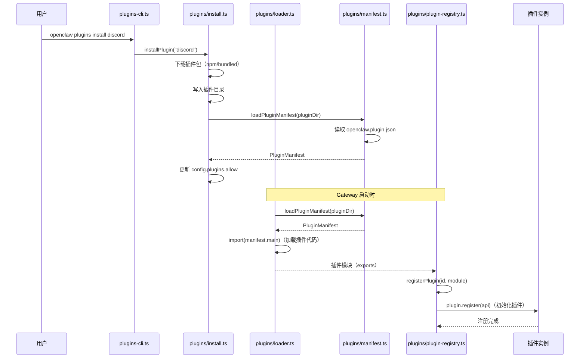
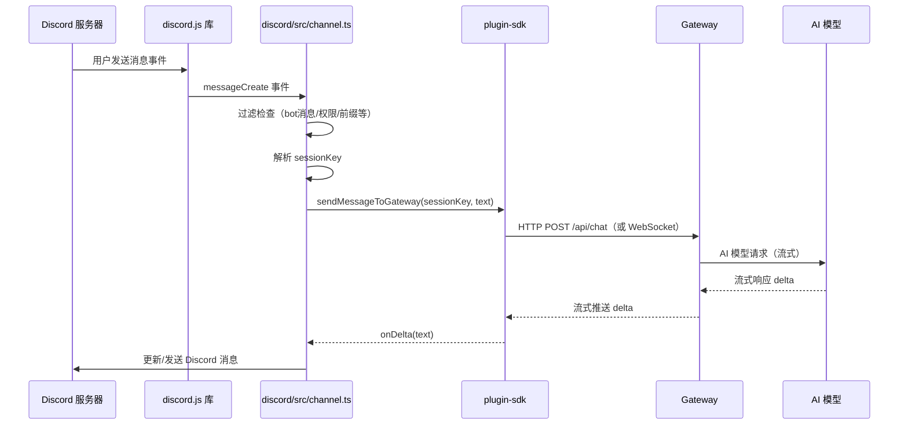
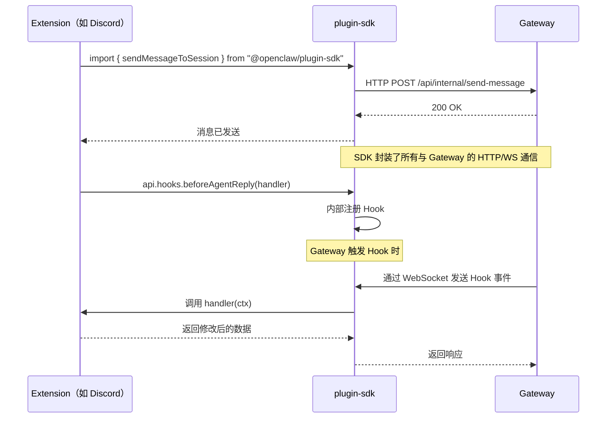
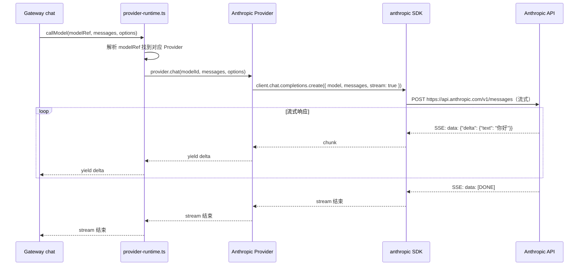

# 第三周详细学习计划（Day 15-21）

> 目标：深入理解 Channel/插件系统——插件架构、Discord Extension、消息处理主循环、Plugin SDK、AI 提供商插件
>
> 前提：已完成第一二周，理解 Gateway 启动流程和 HTTP/WebSocket 服务

---

## Day 15 — 插件架构全览 (5h)

### 学习目标

- 理解插件从清单（`openclaw.plugin.json`）到运行时的完整生命周期
- 理解插件类型：Channel 插件 vs Provider 插件 vs Bundled 插件
- 理解插件注册表（PluginRegistry）的作用

---

### 序列图：插件生命周期



---

### 详细任务清单

#### 任务 1：阅读 `05-channel-plugin-system.md` (1h)

**阅读范围**：`src_code_docs/05-channel-plugin-system.md` 全文

**理解重点**：
- 插件的 3 种类型（Channel / Provider / Bundled）的区别
- 插件清单（`openclaw.plugin.json`）的结构

---

#### 任务 2：精读 `src/plugins/manifest.ts` 前 80 行 (1h)

**阅读范围**：`src/plugins/manifest.ts` L1-80 + L1131-1294

**关键常量和类型**：

```typescript
// src/plugins/manifest.ts L33
const PLUGIN_MANIFEST_FILENAME = "openclaw.plugin.json";

// src/plugins/manifest.ts L243-335（PluginManifest 类型，简化）
type PluginManifest = {
  id: string;             // 插件唯一 ID（如 "discord"）
  version?: string;       // 插件版本
  channels?: string[];    // 提供的 Channel 类型列表
  providers?: string[];   // 提供的 AI Provider 列表
  configSchema?: object;  // 插件配置的 JSON Schema
  channelEnvVars?: Record<string, string[]>;  // 需要的环境变量
  main?: string;          // 入口文件（相对于清单文件的路径）
};
```

**加载插件清单**：

```typescript
// src/plugins/manifest.ts L1151-1294
async function loadPluginManifest(
  rootDir: string,
  rejectHardlinks?: boolean
): Promise<PluginManifestLoadResult> {
  // 1. 找到清单文件路径
  const manifestPath = resolvePluginManifestPath(rootDir);
  // = path.join(rootDir, "openclaw.plugin.json")

  // 2. 检查文件是否存在且不是硬链接（安全检查）
  if (rejectHardlinks) await checkNotHardlink(manifestPath);

  // 3. 读取并解析 JSON
  const raw = JSON.parse(fs.readFileSync(manifestPath, "utf8"));

  // 4. 验证清单格式
  const validated = PluginManifestSchema.parse(raw);

  return { manifest: validated, manifestPath };
}
```

**接口调用关系**：

```
loadPluginManifest(rootDir: string, rejectHardlinks?: boolean)
  → Promise<PluginManifestLoadResult>
  
  PluginManifestLoadResult = {
    manifest: PluginManifest;
    manifestPath: string;
  }
  
  调用方:
    install.ts (安装插件时)
    loader.ts (加载插件时)
    plugin-registry.ts (注册插件时)
```

---

#### 任务 3：精读 `src/plugins/plugin-registry.ts` 前 80 行 (1h)

**阅读范围**：`src/plugins/plugin-registry.ts` L1-80

**插件注册表的核心职责**：

```typescript
class PluginRegistry {
  // 按 ID 存储所有已注册的插件
  private plugins: Map<string, RegisteredPlugin> = new Map();

  // 注册一个插件
  register(id: string, plugin: PluginModule): void {
    this.plugins.set(id, { id, plugin, state: "registered" });
  }

  // 获取 Channel 插件（按 Channel 类型）
  getChannelPlugin(channelType: string): ChannelPlugin | undefined {
    for (const [, registered] of this.plugins) {
      if (registered.plugin.channels?.includes(channelType)) {
        return registered.plugin as ChannelPlugin;
      }
    }
    return undefined;
  }

  // 获取 Provider 插件
  getProviderPlugin(providerId: string): ProviderPlugin | undefined {
    return this.plugins.get(providerId)?.plugin as ProviderPlugin;
  }
}
```

---

#### 任务 4：精读 `src/plugins/loader.ts` 前 80 行 (1h)

**阅读范围**：`src/plugins/loader.ts` L1-80

**插件加载过程**：

```typescript
// 加载单个插件
async function loadPlugin(
  pluginDir: string,
  registry: PluginRegistry
): Promise<void> {
  // 1. 加载清单
  const { manifest } = await loadPluginManifest(pluginDir);

  // 2. 动态加载插件代码
  const pluginModule = await import(
    path.join(pluginDir, manifest.main ?? "index.js")
  );

  // 3. 获取默认导出（插件实例）
  const plugin = pluginModule.default;
  if (!plugin) throw new Error(`Plugin ${manifest.id} has no default export`);

  // 4. 注册到注册表
  registry.register(manifest.id, plugin);
}
```

---

#### 任务 5：精读 `src/plugins/install.ts` 前 60 行 (1h)

**阅读范围**：`src/plugins/install.ts` L1-60

**插件安装流程**：

```typescript
// 安装插件（简化）
async function installPlugin(
  pluginId: string,
  config: OpenClawConfig
): Promise<void> {
  // 1. 检查是否是 bundled 插件（如 discord、anthropic）
  if (isBundledPlugin(pluginId)) {
    // bundled 插件不需要下载，直接在 extensions/ 目录下
    const pluginDir = path.join(EXTENSIONS_DIR, pluginId);
    // 2. 更新配置：将插件加入 plugins.allow 列表
    await mutateConfigFile((config) => ({
      ...config,
      plugins: {
        ...config.plugins,
        allow: [...(config.plugins?.allow ?? []), pluginId],
      },
    }));
    return;
  }

  // 3. 非 bundled 插件：通过 npm 安装
  await runNpm(["install", `@openclaw/${pluginId}`]);
}
```

---

### Debug 实操：观察插件加载

```typescript
// src/plugins/loader.ts 的加载函数中添加：
console.error(`[loader] 加载插件 ${manifest.id} 从 ${pluginDir}`);
```

```bash
pnpm build && OPENCLAW_LOG_LEVEL=debug node openclaw.mjs start 2>&1 | grep "\[loader\]"
```

---

### 知识检验

1. `openclaw.plugin.json` 中的 `channels` 字段是什么意思？
2. `PluginRegistry.getChannelPlugin("discord")` 是如何找到 Discord 插件的？
3. bundled 插件和 npm 插件安装有什么区别？

---

## Day 16 — Discord Extension 深入 (6h)

### 学习目标

- 完全读懂一个真实的 Extension（Discord）
- 理解 `defineBundledChannelEntry()` 的工作机制
- 理解 Channel 如何接收消息并发送给 Gateway

---

### 序列图：Discord 消息处理完整流程



---

### 详细任务清单

#### 任务 1：阅读 `extensions/discord/openclaw.plugin.json` (30m)

**阅读范围**：`extensions/discord/openclaw.plugin.json` 全文（12 行）

**文件内容解析**：

```json
{
  "id": "discord",
  "channels": ["discord"],
  "channelEnvVars": {
    "discord": ["DISCORD_BOT_TOKEN"]
  },
  "configSchema": { ... }
}
```

**字段说明**：
- `"id": "discord"` — 插件唯一标识，用于 `config.plugins.allow`
- `"channels": ["discord"]` — 该插件提供名为 "discord" 的 Channel 类型
- `"channelEnvVars"` — 启用 discord Channel 需要设置的环境变量
- `"configSchema"` — Discord Channel 配置的 JSON Schema（用于 UI 展示）

---

#### 任务 2：阅读 `extensions/discord/index.ts` (30m)

**阅读范围**：`extensions/discord/index.ts` 全文（25 行）

**关键 API `defineBundledChannelEntry()`**：

```typescript
// extensions/discord/index.ts
export default defineBundledChannelEntry({
  id: "discord",
  name: "Discord",
  description: "Discord bot channel",
  importMetaUrl: import.meta.url,  // 用于解析相对路径

  // Channel 插件主体（通过动态导入延迟加载）
  plugin: {
    specifier: "./channel-plugin-api.js",  // 文件路径
    exportName: "discordPlugin",            // 导出名称
  },

  // 账号检查（检查 bot 是否连接正常）
  accountInspect: ...,

  // 注册 Hooks
  registerFull(api) {
    api.hooks.beforeAgentReply(async (ctx) => {
      // 可选：在 AI 回复前插入逻辑
    });
  },
});
```

**`defineBundledChannelEntry` 的作用**：
- 将插件描述信息封装成标准格式
- 管理懒加载（只有需要时才加载 `channel-plugin-api.js`）
- 提供统一的 Hook 注册入口

---

#### 任务 3：精读 `extensions/discord/src/channel.ts` 前 150 行 (2h)

**阅读范围**：`extensions/discord/src/channel.ts` L1-150

**消息过滤逻辑**（找到以下判断条件）：

```typescript
// extensions/discord/src/channel.ts
function shouldProcessMessage(message: DiscordMessage, config: DiscordConfig): boolean {
  // 过滤 1：忽略来自 bot 的消息（避免循环响应）
  if (message.author.bot) return false;

  // 过滤 2：检查频道白名单（如果配置了的话）
  if (config.channels && !config.channels.includes(message.channelId)) {
    return false;
  }

  // 过滤 3：检查用户白名单（如果配置了的话）
  if (config.allowedUsers && !config.allowedUsers.includes(message.author.id)) {
    return false;
  }

  // 过滤 4：检查消息前缀（如果配置了触发前缀）
  if (config.prefix && !message.content.startsWith(config.prefix)) {
    return false;
  }

  return true;
}
```

**Session Key 构建**：

```typescript
// 构建 Discord 消息的 Session Key
function buildDiscordSessionKey(message: DiscordMessage): string {
  if (message.guildId) {
    // 服务器频道消息
    // 格式：agent:main:discord/guildId/channelId
    return buildAgentPeerSessionKey({
      agentId: DEFAULT_AGENT_ID,
      channel: "discord",
      accountId: message.guildId,
      conversationId: message.channelId,
    });
  } else {
    // DM 私信消息
    // 格式：agent:main:discord/default/userId
    return buildAgentPeerSessionKey({
      agentId: DEFAULT_AGENT_ID,
      channel: "discord",
      accountId: "default",
      conversationId: message.author.id,
    });
  }
}
```

---

#### 任务 4：阅读 `extensions/discord/src/accounts.ts` (1h)

**阅读范围**：`extensions/discord/src/accounts.ts` 全文

**账号（Bot 实例）管理**：
- 一个 Discord Channel 可以配置多个 Bot（多账号）
- 每个账号对应一个 Discord Bot token
- `AccountsManager` 负责管理多个 Bot 客户端

---

#### 任务 5：阅读 `extensions/discord/src/outbound-adapter.ts` (1h)

**阅读范围**：`extensions/discord/src/outbound-adapter.ts` 全文

**发送消息到 Discord**：

```typescript
// 流式发送响应（AI 边生成边更新 Discord 消息）
class DiscordOutboundAdapter {
  private editBuffer = "";
  private discordMessage?: DiscordMessage;

  // 接收流式 delta（部分文本）
  async onDelta(delta: string) {
    this.editBuffer += delta;

    // 节流：避免过于频繁地编辑 Discord 消息（Discord API 限速）
    if (!this.editTimer) {
      this.editTimer = setTimeout(() => this.flushEdit(), 500);
    }
  }

  // 将缓冲区内容发送到 Discord
  private async flushEdit() {
    this.editTimer = undefined;
    if (!this.discordMessage) {
      // 首次创建消息
      this.discordMessage = await this.channel.send(this.editBuffer);
    } else {
      // 编辑已有消息（流式更新）
      await this.discordMessage.edit(this.editBuffer);
    }
  }
}
```

---

### Debug 实操：在 Discord Channel 中添加日志

```typescript
// extensions/discord/src/channel.ts，在消息处理函数开始处：
console.error(`[discord] 收到消息: "${message.content.slice(0, 50)}" from ${message.author.tag}`);
console.error(`[discord] shouldProcess: ${shouldProcessMessage(message, config)}`);
console.error(`[discord] sessionKey: ${buildDiscordSessionKey(message)}`);
```

---

### 知识检验

1. Discord Channel 什么情况下会忽略一条消息？（至少说出 3 个条件）
2. Discord DM（私信）和服务器频道消息的 Session Key 格式有什么区别？
3. 为什么发送 Discord 消息要节流（每 500ms 才更新一次）？

---

## Day 17 — Channel 消息处理主循环 (5h)

### 学习目标

- 深入理解 `draft-stream-loop.ts` — OpenClaw 中最核心的消息处理循环
- 理解流式响应的处理模式（delta → buffer → 完整响应）
- 理解防抖、取消、并发控制

---

### 序列图：消息处理主循环

```mermaid
sequenceDiagram
    participant channel as Channel 插件
    participant loop as draft-stream-loop.ts
    participant session as Session 存储
    participant gateway as Gateway chat
    participant ai as AI 模型

    channel->>loop: submitMessage(sessionKey, text)
    loop->>loop: 防抖等待 50ms（合并快速连续消息）
    loop->>loop: 取消前一个未完成的请求（如果有）
    loop->>session: loadOrCreateSession(sessionKey)
    loop->>session: loadTranscript(sessionKey)（加载对话历史）
    loop->>gateway: streamChat(messages, model)
    gateway->>ai: POST /v1/chat/completions（流式）

    loop alt 流式响应处理
        ai-->>gateway: delta: "你好"
        gateway-->>loop: onDelta("你好")
        loop->>channel: sendDraft("你好")（更新中间状态）

        ai-->>gateway: delta: "！"
        gateway-->>loop: onDelta("！")
        loop->>channel: sendDraft("你好！")

        ai-->>gateway: [DONE]
        gateway-->>loop: onComplete()
    end

    loop->>channel: finalizeReply("你好！")（发送最终消息）
    loop->>session: persistTranscript(userMsg + assistantMsg)
    loop->>session: updateSessionMeta(tokenCount, updatedAt)
```

---

### 详细任务清单

#### 任务 1：精读 `src/channels/draft-stream-loop.ts` (1.5h)

**阅读范围**：`src/channels/draft-stream-loop.ts` 全文

**核心数据结构**：

```typescript
// 消息处理循环的状态
type DraftStreamState = {
  sessionKey: string;
  currentAbortController?: AbortController;  // 用于取消当前请求
  pendingMessage?: string;                   // 防抖：等待中的消息
  debounceTimer?: NodeJS.Timeout;            // 防抖计时器
  draftText: string;                         // 已收到的响应文本（累积）
};
```

**防抖机制**（避免用户快速发消息导致多次 AI 请求）：

```typescript
// 防抖：50ms 内的多条消息合并为最后一条
function debounceMessage(state: DraftStreamState, text: string): Promise<void> {
  return new Promise((resolve) => {
    // 取消之前的计时器
    if (state.debounceTimer) {
      clearTimeout(state.debounceTimer);
    }
    state.pendingMessage = text;

    // 50ms 后才真正处理
    state.debounceTimer = setTimeout(() => {
      state.debounceTimer = undefined;
      resolve();
    }, 50);
  });
}
```

**取消前一个请求**（用户新消息到来时）：

```typescript
// 如果 AI 还在处理上一条消息，取消它
if (state.currentAbortController) {
  state.currentAbortController.abort();  // 触发取消信号
  await state.currentStreamPromise;      // 等待上一个请求清理完毕
}

// 创建新的取消控制器
state.currentAbortController = new AbortController();
```

---

#### 任务 2：精读 `src/channels/draft-stream-controls.ts` (1h)

**阅读范围**：`src/channels/draft-stream-controls.ts` 全文

**流式控制接口**：

```typescript
// Channel 插件需要实现的流式控制接口
interface DraftStreamControls {
  // 发送草稿（中间状态，AI 还在生成时更新消息）
  sendDraft(text: string): Promise<void>;

  // 发送最终回复（AI 生成完毕）
  finalizeReply(text: string): Promise<void>;

  // 发送错误信息
  sendError(error: Error): Promise<void>;

  // 取消当前流（用户中断时）
  cancel(): void;
}
```

**Discord 的实现示例**（在 `outbound-adapter.ts` 中）：
- `sendDraft()` → 节流后调用 Discord API 编辑消息
- `finalizeReply()` → 发送最终消息，标记为完成
- `sendError()` → 发送错误提示

---

#### 任务 3：精读 `src/channels/run-state-machine.ts` (1h)

**阅读范围**：`src/channels/run-state-machine.ts` 全文

**状态机设计**：

```typescript
// Channel 运行状态机的状态
type ChannelRunState =
  | { type: "idle" }               // 等待新消息
  | { type: "processing"; abortController: AbortController } // 处理中
  | { type: "aborting" }           // 取消中
  | { type: "error"; error: Error }; // 错误状态

// 状态转换规则
type ChannelRunEvent =
  | { type: "MESSAGE_RECEIVED"; text: string }  // 新消息到来
  | { type: "AI_STREAM_STARTED" }               // AI 开始回复
  | { type: "AI_STREAM_COMPLETE" }              // AI 完成回复
  | { type: "ERROR"; error: Error }             // 发生错误
  | { type: "ABORT_REQUESTED" };                // 用户请求取消
```

**状态转换图**：

```
IDLE ──MESSAGE_RECEIVED──→ PROCESSING
PROCESSING ──AI_STREAM_COMPLETE──→ IDLE
PROCESSING ──ABORT_REQUESTED──→ ABORTING
PROCESSING ──ERROR──→ ERROR
ABORTING ──AbortCompleted──→ IDLE
ERROR ──MESSAGE_RECEIVED──→ PROCESSING（错误后允许重试）
```

---

#### 任务 4：阅读 `src/channels/session.ts` (1.5h)

**阅读范围**：`src/channels/session.ts` 全文

**Channel 会话管理**：

```typescript
// Channel 层的会话对象
class ChannelSession {
  constructor(
    public readonly sessionKey: string,
    private readonly agentId: string,
  ) {}

  // 加载或创建会话
  static async loadOrCreate(
    sessionKey: string,
    config: OpenClawConfig
  ): Promise<ChannelSession> {
    const store = await loadSessionStore({ storePath: getStorePath() });
    const existing = store.getSession(sessionKey);
    if (!existing) {
      await store.upsertSession({
        sessionKey,
        agentId: DEFAULT_AGENT_ID,
        createdAt: Date.now(),
        updatedAt: Date.now(),
      });
    }
    return new ChannelSession(sessionKey, existing?.agentId ?? DEFAULT_AGENT_ID);
  }
}
```

---

### Debug 实操：追踪消息处理流程

```typescript
// src/channels/draft-stream-loop.ts 关键位置添加日志：

// 1. 接收到新消息时
console.error(`[draft-stream] 收到消息，sessionKey=${sessionKey}, text="${text.slice(0, 30)}"`);

// 2. 防抖完成时
console.error(`[draft-stream] 防抖完成，开始处理`);

// 3. 取消旧请求时
console.error(`[draft-stream] 取消旧请求，创建新 AbortController`);

// 4. 收到 AI delta 时
console.error(`[draft-stream] AI delta: "${delta.slice(0, 20)}"`);

// 5. AI 完成时
console.error(`[draft-stream] AI 完成，最终文本长度: ${finalText.length}`);
```

---

### 知识检验

1. 为什么需要 50ms 的防抖？（答：避免用户连续发多条短消息触发多次 AI 请求）
2. 当用户发送第二条消息时，第一条消息的 AI 请求会发生什么？
3. `DraftStreamControls.sendDraft()` 和 `finalizeReply()` 有什么区别？

---

## Day 18 — Plugin SDK (5h)

### 学习目标

- 理解 `packages/plugin-sdk/` 为插件开发者提供的工具集
- 理解 Channel 核心 API
- 对比 Discord 和 Telegram Extension 的结构差异

---

### 序列图：Plugin SDK 与 Gateway 的交互



---

### 详细任务清单

#### 任务 1：浏览 `packages/plugin-sdk/` 目录结构 (1h)

```bash
ls packages/plugin-sdk/src/
```

**主要模块**：

| 文件 | 功能 |
|------|------|
| `channel-core.ts` | Channel 核心 API（最重要）|
| `status-helpers.ts` | 状态消息帮助函数 |
| `target-resolver-runtime.ts` | 消息目标解析 |
| `hooks.ts` | Hook 注册 API |
| `session-key.ts` | Session Key 工具（重导出）|

---

#### 任务 2：精读 `packages/plugin-sdk/src/channel-core.ts` (1h)

**阅读范围**：`packages/plugin-sdk/src/channel-core.ts` 全文

**Channel 开发者使用的核心 API**：

```typescript
// plugin-sdk 提供给 Extension 的 API
export interface ChannelCoreApi {
  // 发送消息到指定会话（触发 AI 处理）
  submitMessage(params: {
    sessionKey: string;
    text: string;
    attachments?: Attachment[];
    metadata?: Record<string, unknown>;
  }): Promise<void>;

  // 直接发送系统消息（不经过 AI）
  sendSystemMessage(params: {
    sessionKey: string;
    text: string;
  }): Promise<void>;

  // 获取指定会话的历史记录
  getTranscript(sessionKey: string): Promise<TranscriptEntry[]>;
}
```

---

#### 任务 3：阅读 `packages/plugin-sdk/src/status-helpers.ts` (1h)

**阅读范围**：`packages/plugin-sdk/src/status-helpers.ts` 全文

**状态消息帮助函数**（显示 "AI 正在思考..." 类的提示）：

```typescript
// 创建加载状态消息
function createLoadingStatus(text: string): StatusMessage {
  return { type: "loading", text };
}

// 创建成功状态消息
function createSuccessStatus(text: string): StatusMessage {
  return { type: "success", text };
}

// 创建错误状态消息
function createErrorStatus(error: Error): StatusMessage {
  return { type: "error", text: error.message };
}
```

---

#### 任务 4：阅读 `packages/plugin-sdk/src/target-resolver-runtime.ts` (1h)

**阅读范围**：`packages/plugin-sdk/src/target-resolver-runtime.ts` 全文

**目标解析**（如何将用户指定的 Agent/Session 名称解析为 Session Key）：

```typescript
// 解析消息发送目标
async function resolveMessageTarget(params: {
  agentId?: string;    // 目标 Agent（默认 "main"）
  channel?: string;    // Channel 类型
  accountId?: string;  // 账号 ID
  conversationId?: string; // 对话 ID
}): Promise<string> {  // 返回 sessionKey
  return buildAgentPeerSessionKey({
    agentId: params.agentId ?? DEFAULT_AGENT_ID,
    channel: params.channel ?? "default",
    accountId: params.accountId ?? "default",
    conversationId: params.conversationId ?? "main",
  });
}
```

---

#### 任务 5：对比 Discord 和 Telegram Extension 的结构差异 (1h)

```bash
# 查看 Telegram Extension 结构
ls extensions/telegram/
ls extensions/telegram/src/
```

**对比维度**：

| 维度 | Discord Extension | Telegram Extension |
|------|-------------------|--------------------|
| 消息事件 | `messageCreate` | `message` |
| Bot 库 | `discord.js` | `telegraf` |
| Session Key 格式 | `agent:main:discord/guildId/channelId` | `agent:main:telegram/default/chatId` |
| 过滤条件 | guild/channel/user 白名单 | chat ID 白名单 |
| 回复方式 | 编辑消息（流式） | 发送新消息（流式） |
| Slash Commands | 支持 `/ping` 等 | 支持 `/start` 等 |

---

### 知识检验

1. `submitMessage()` 和 `sendSystemMessage()` 的区别是什么？（答：前者触发 AI 处理，后者直接发送）
2. Discord 和 Telegram 的 Session Key 格式有什么不同？
3. `target-resolver-runtime.ts` 的作用是什么？

---

## Day 19 — 提供商插件（AI 模型）(5h)

### 学习目标

- 理解 Anthropic Provider 插件的实现
- 理解 Provider 运行时如何管理多个 AI 提供商
- 理解 OpenAI 兼容接口的实现

---

### 序列图：AI 模型调用流程



---

### 详细任务清单

#### 任务 1：阅读 `extensions/anthropic/openclaw.plugin.json` + 核心文件 (1.5h)

**阅读范围**：
- `extensions/anthropic/openclaw.plugin.json`（清单）
- `extensions/anthropic/` 主要源文件

**Provider 插件清单的额外字段**：

```json
{
  "id": "anthropic",
  "providers": ["anthropic"],  // 提供的 AI Provider 类型
  "configSchema": {
    "properties": {
      "anthropic": {
        "type": "object",
        "properties": {
          "apiKey": { "type": "string" },
          "baseURL": { "type": "string" }
        }
      }
    }
  }
}
```

**Provider 插件接口**：

```typescript
// Provider 插件必须实现的接口
interface ProviderPlugin {
  id: string;  // Provider ID（如 "anthropic"）

  // 核心：流式调用 AI 模型
  chat(params: {
    model: string;
    messages: ChatMessage[];
    systemPrompt?: string;
    maxTokens?: number;
    signal?: AbortSignal;  // 用于取消请求
  }): AsyncIterable<ChatDelta>;  // 异步迭代器（逐块返回）
}

// ChatDelta 结构
type ChatDelta =
  | { type: "text"; text: string }          // 文本 delta
  | { type: "tool_call"; name: string; ... } // 工具调用
  | { type: "usage"; input: number; output: number }; // token 统计
```

---

#### 任务 2：精读 `src/plugins/provider-runtime.ts` 前 80 行 (1h)

**阅读范围**：`src/plugins/provider-runtime.ts` L1-80

**Provider 运行时的作用**：

```typescript
// 管理多个 Provider 的运行时
class ProviderRuntime {
  private providers: Map<string, ProviderPlugin> = new Map();

  // 注册 Provider
  register(id: string, provider: ProviderPlugin) {
    this.providers.set(id, provider);
  }

  // 通过模型 ID 解析 Provider 并调用
  async callModel(
    modelRef: ModelRef,  // { provider: "anthropic", model: "claude-sonnet-4-6" }
    messages: ChatMessage[],
    options: ChatOptions
  ): AsyncIterable<ChatDelta> {
    const provider = this.providers.get(modelRef.provider);
    if (!provider) {
      throw new Error(`Provider "${modelRef.provider}" not found`);
    }
    yield* provider.chat({ model: modelRef.model, messages, ...options });
  }
}
```

---

#### 任务 3：阅读 `src/model-catalog/` (1h)

**阅读范围**：`src/model-catalog/` 目录下所有文件

**模型目录的作用**：
- 维护所有已知模型的列表
- 提供模型元信息（上下文窗口大小、是否支持 Vision、价格等）
- 支持通过简短名称（如 `claude-sonnet-4-6`）找到对应 Provider

```typescript
// 模型目录条目
type ModelEntry = {
  id: string;                // 完整模型 ID
  provider: string;          // 所属 Provider
  contextLength: number;     // 最大上下文 token 数
  supportsVision: boolean;   // 是否支持图像输入
  supportsToolUse: boolean;  // 是否支持工具调用
};
```

---

#### 任务 4：阅读 `src/gateway/openai-http.ts` 前 100 行 (1.5h)

**阅读范围**：`src/gateway/openai-http.ts` L1-100

**OpenAI 兼容 API 的实现**：

```typescript
// 处理 POST /v1/chat/completions
async function handleChatCompletions(
  req: http.IncomingMessage,
  res: http.ServerResponse,
  runtimeState: GatewayRuntimeState
) {
  // 1. 解析请求体
  const body = await parseJsonBody(req);
  // body 格式：{ model, messages, stream, max_tokens, ... }

  // 2. 解析模型引用
  const modelRef = resolveModelRef(body.model, runtimeState.config);

  // 3. 调用 Provider（流式）
  const stream = runtimeState.providerRuntime.callModel(
    modelRef,
    body.messages,
    { maxTokens: body.max_tokens, signal: runtimeState.signal }
  );

  // 4. 以 OpenAI 流式格式返回
  res.writeHead(200, {
    "Content-Type": "text/event-stream",
    "Cache-Control": "no-cache",
    "Connection": "keep-alive",
  });

  for await (const delta of stream) {
    if (delta.type === "text") {
      // OpenAI SSE 格式
      const chunk = {
        choices: [{ delta: { content: delta.text }, finish_reason: null }],
      };
      res.write(`data: ${JSON.stringify(chunk)}\n\n`);
    }
  }

  res.write("data: [DONE]\n\n");
  res.end();
}
```

---

### Debug 实操：观察 AI 请求流

```typescript
// src/plugins/provider-runtime.ts 中添加：
console.error(`[provider-runtime] 调用模型: ${modelRef.provider}/${modelRef.model}`);
console.error(`[provider-runtime] 消息数量: ${messages.length}`);
```

```typescript
// 在 Provider 实现中添加（anthropic extension）：
for await (const delta of provider.chat(params)) {
  console.error(`[anthropic] delta type: ${delta.type}, ${delta.type === "text" ? `text: "${delta.text?.slice(0, 20)}"` : ""}`);
  yield delta;
}
```

---

### 知识检验

1. `ProviderPlugin.chat()` 返回什么类型？（答：`AsyncIterable<ChatDelta>`）
2. `AsyncIterable` 如何使用？（答：`for await (const item of iterable) { ... }`）
3. OpenAI 兼容 API 的流式响应格式是什么？（答：SSE 格式，`data: {...}\n\n`）

---

## Day 20 — 巩固：Telegram 对比分析 (5h)

### 学习目标

- 深入对比 Discord 和 Telegram Extension 的差异
- 理解不同 Chat 平台的适配策略
- 完成一个消息过滤逻辑的分析练习

---

### 任务 1：全面阅读 Telegram Extension (2h)

```bash
ls extensions/telegram/
ls extensions/telegram/src/
```

**阅读重点**：
- `extensions/telegram/src/channel.ts` — Telegram 特有的消息处理逻辑
- `extensions/telegram/src/outbound-adapter.ts` — Telegram 消息发送（使用 Telegraf API）

**Telegram 特有概念**：
- **Chat ID**：Telegram 的对话标识（群组是负数，私聊是用户 ID）
- **Update 类型**：Telegram 发给 Bot 的事件类型（`message`、`callback_query` 等）
- **Reply Markup**：Telegram 的按钮/键盘组件

---

### 任务 2：完成对比表格 (1h)

填写以下对比表格（通过阅读源码）：

| 对比维度 | Discord | Telegram | 说明 |
|---------|---------|----------|------|
| Bot 库 | discord.js | telegraf | npm 包名 |
| 消息事件名 | `messageCreate` | `message` | Event 名称 |
| 唯一标识 | `guildId`/`channelId` | `chatId` | 如何区分对话 |
| Session Key 格式 | `discord/<guildId>/<channelId>` | `telegram/default/<chatId>` | 实际格式 |
| 过滤 Bot 消息 | `message.author.bot` | `ctx.message.from.is_bot` | 判断条件 |
| 流式发送 | 编辑消息 | `editMessageText` | API 方式 |
| 富文本 | Markdown/Embeds | MarkdownV2/HTML | 格式支持 |

---

### 任务 3：找到 Discord 消息过滤逻辑 (2h)

**目标**：在 `extensions/discord/src/channel.ts` 中找到并理解所有消息过滤条件。

**使用 grep 搜索**：
```bash
# 搜索 return false 的过滤逻辑
grep -n "return false\|return;\|ignore\|skip" extensions/discord/src/channel.ts | head -20
```

**整理过滤逻辑清单**：

```typescript
// 找到类似以下的所有过滤条件：
if (message.author.bot) return false;        // 过滤 bot 消息
if (!message.content.trim()) return false;   // 过滤空消息
if (message.author.id === client.user.id) return false;  // 过滤自己的消息
// ... 还有哪些？
```

---

## Day 21 — 巩固实践：添加 Discord /ping 命令 (5h)

### 学习目标

- 综合运用第三周所学，完成一个真实的功能添加
- 给 Discord Bot 添加 `/ping` Slash Command，直接回复 `pong!`（不经过 AI）

---

### 实现方案

**目标**：当用户在 Discord 输入 `/ping` 时，Bot 直接回复 `pong!`，不经过 AI 处理。

**实施步骤**：

**步骤 1**：找到 Discord Extension 中 Slash Command 的注册位置

```bash
grep -n "slash\|command\|interaction\|applicationCommand" \
  extensions/discord/src/channel.ts | head -20
```

**步骤 2**：添加 Slash Command 注册代码

```typescript
// 在 Discord Client 就绪时注册 Slash Command
client.on("ready", async () => {
  // 注册全局 Slash Command
  await client.application?.commands.create({
    name: "ping",
    description: "Check if the bot is alive",
  });
  console.log("Registered /ping command");
});
```

**步骤 3**：处理 Slash Command 交互

```typescript
// 在消息处理器旁边添加交互处理器
client.on("interactionCreate", async (interaction) => {
  if (!interaction.isChatInputCommand()) return;

  if (interaction.commandName === "ping") {
    // 直接回复，不经过 AI
    await interaction.reply("pong!");
  }
});
```

**步骤 4**：确保不影响普通消息的 AI 处理

注意：`interactionCreate` 事件和 `messageCreate` 事件是独立的，不会相互影响。

**步骤 5**：测试

```bash
# 需要真实的 Discord Bot Token
DISCORD_BOT_TOKEN=your-bot-token node openclaw.mjs start
```

在 Discord 中输入 `/ping`，预期得到 `pong!` 回复。

---

### 第三周总结检验

1. **插件清单**：`openclaw.plugin.json` 中 `channels` 字段和 `providers` 字段的区别？
2. **插件加载**：`loadPlugin()` 调用 `import(manifest.main)` 后，期望插件模块导出什么？
3. **Discord 过滤**：至少说出 3 个会导致消息被忽略的条件
4. **Session Key**：Discord 频道消息的 Session Key 格式（不含 `agent:main:` 前缀）是什么？
5. **流式响应**：`sendDraft()` 和 `finalizeReply()` 分别在什么时机调用？
6. **Provider 接口**：`ProviderPlugin.chat()` 的返回类型是什么？
7. **OpenAI 兼容**：`/v1/chat/completions` 流式响应的 SSE 格式是什么？

---

## 附录：第三周关键文件速查

```
src/plugins/manifest.ts              # 插件清单（1425行）
  L33   PLUGIN_MANIFEST_FILENAME
  L243  PluginManifest 类型
  L1131 resolvePluginManifestPath()
  L1151 loadPluginManifest()

src/plugins/plugin-registry.ts       # 插件注册表（前80行）
src/plugins/loader.ts                # 插件加载器（前80行）
src/plugins/install.ts               # 插件安装（前60行）

extensions/discord/
  openclaw.plugin.json               # Discord 清单（12行）
  index.ts                           # Discord 入口（25行）
  src/channel.ts                     # Discord Channel（前150行重点）
  src/accounts.ts                    # 账号管理
  src/outbound-adapter.ts            # 消息发送

extensions/telegram/
  (类似结构，对比阅读)

src/channels/draft-stream-loop.ts    # 消息处理主循环（最重要）
src/channels/draft-stream-controls.ts  # 流式控制接口
src/channels/run-state-machine.ts    # 运行状态机
src/channels/session.ts              # Channel 会话

packages/plugin-sdk/src/
  channel-core.ts                    # Channel 核心 API
  status-helpers.ts                  # 状态消息工具
  target-resolver-runtime.ts         # 目标解析

extensions/anthropic/                # Anthropic Provider
src/plugins/provider-runtime.ts      # Provider 运行时（前80行）
src/model-catalog/                   # 模型目录
src/gateway/openai-http.ts           # OpenAI 兼容 API（前100行）
```
